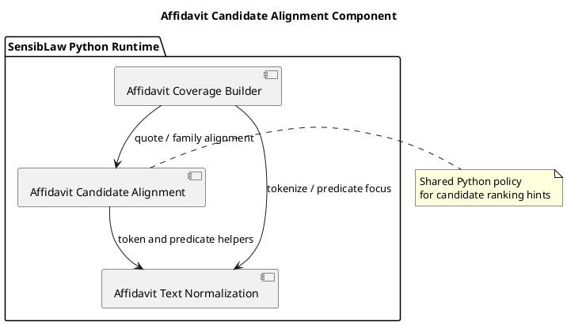

# Affidavit Candidate Alignment Component (2026-03-30)

## Purpose
Define the next bounded Python-only normalization slice for the affidavit lane:
extract candidate-alignment text policy from the main affidavit builder into a
shared component.

This continues the controlled Python normalization path for the affidavit lane.

## ITIL change frame

- Change type: standard change
- Service boundary: affidavit review / contested narrative runtime
- Risk: low to moderate, because the slice preserves behavior but touches the
  bounded family-alignment heuristics used during candidate ranking
- Backout: restore the helper logic to the builder if parity breaks

## ISO 9000 quality intent

The quality objective is to give candidate-alignment text policy one explicit
owner.

That owner should define:

- predicate-alignment scoring
- quote-rebuttal support detection
- sibling-family adjustment rules
- revocation-family adjustment rules

## Six Sigma defect target

Current defect mode:

- candidate-alignment heuristics are buried inside the main builder
- future affidavit lanes are likely to reproduce those adjustments instead of
  reusing them

This slice reduces variation by making one canonical Python component for:

- predicate alignment score
- quote-rebuttal support detection
- family-alignment adjustment

## C4 component reading

Container:

- SensibLaw Python runtime

Components after this slice:

- affidavit coverage builder:
  arbitration and relation typing
- affidavit text normalization component:
  tokenization and decomposition policy
- affidavit claim-root component:
  duplicate-root and claim-root text policy
- affidavit candidate-alignment component:
  candidate-scoring text heuristics

## PlantUML sketch

## Acceptance

This slice is complete when:

- candidate-alignment helpers no longer live inline in the main builder
- they live in one Python-owned shared module
- the builder still exposes the same helper names for current callers and
  tests
- focused affidavit tests remain green

## Non-goals

This slice does not:

- change candidate arbitration order
- move relation classification
- redesign the family-rule inventory
- change the artifact schema
