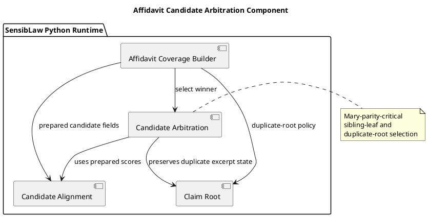

# Affidavit Candidate Arbitration Component (2026-03-30)

## Purpose
Define the next bounded Python-only normalization slice for the affidavit lane:
extract candidate arbitration policy from the main affidavit builder into a
shared component.

This is the first promoted implementation lane under the Mary-parity reading,
because the remaining high-signal defect is still sibling-leaf and
duplicate-root winner selection rather than generic helper sprawl.

## ITIL change frame

- Change type: standard change
- Service boundary: affidavit review / contested narrative runtime
- Risk: moderate, because the slice preserves behavior but touches the final
  candidate winner path
- Backout: restore the builder-local arbitration block if parity breaks

## ISO 9000 quality intent

The quality objective is to give arbitration policy one explicit owner.

That owner should define:

- baseline winner selection order
- duplicate-root alternate promotion
- proposition-echo fallback
- clause-level alternate promotion
- final selected-candidate packaging

## Six Sigma defect target

Current defect mode:

- same-incident sibling leaves can still cross-swap under one composite row
- duplicate-root candidates and substantive alternates are still selected in a
  builder-local block
- tie-break logic is implicit rather than owned by one reusable policy module

This slice reduces variation by making one canonical Python component for:

- best-candidate ordering
- duplicate-root alternate promotion
- echo replacement
- clause alternate promotion
- final arbitration result packaging

## C4 component reading

Container:

- SensibLaw Python runtime

Components after this slice:

- affidavit coverage builder:
  candidate preparation and downstream relation work
- affidavit text normalization component:
  tokenization and decomposition policy
- affidavit claim-root component:
  duplicate-root and claim-root text policy
- affidavit candidate-alignment component:
  predicate, quote, and family-adjustment policy
- affidavit candidate-arbitration component:
  winner and alternate selection policy

## PlantUML sketch

## Acceptance

This slice is complete when:

- the winner-selection and alternate-promotion block no longer lives inline in
  the main builder
- it lives in one Python-owned shared module
- the builder still returns the same selected result fields
- focused arbitration regressions remain green

## Non-goals

This slice does not:

- change arbitration order
- move response semantics
- move relation classification
- change artifact schema
