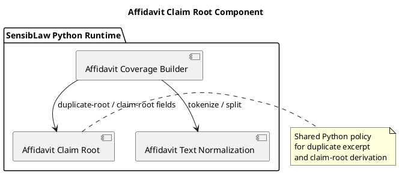

# Affidavit Claim Root Component (2026-03-30)

## Purpose
Define the next bounded Python-only normalization slice for the affidavit lane:
extract duplicate-response and claim-root text policy from the main affidavit
builder into a shared component.

This continues the controlled Python normalization path already established for
affidavit reconciliation text and text normalization.

## ITIL change frame

- Change type: standard change
- Service boundary: affidavit review / contested narrative runtime
- Risk: low, because the slice is behavior-preserving and already covered by
  focused builder tests
- Backout: restore the helper logic to the builder if parity breaks

## ISO 9000 quality intent

The quality objective is to give claim-root text policy one explicit owner.

That owner should define:

- when a response excerpt counts as a duplicate or near-duplicate of the
  proposition
- how the stable claim-root text is selected
- how the stable claim-root identifier is formed
- when alternate context should be preserved alongside the duplicate-root text

## Six Sigma defect target

Current defect mode:

- duplicate-root and claim-root text rules are buried inside the main builder
- future contested-response lanes are likely to reproduce that logic instead of
  reusing it

This slice reduces variation by making one canonical Python component for:

- duplicate response excerpt detection
- claim-root text normalization
- stable claim-root id generation
- claim-root field derivation

## C4 component reading

Container:

- SensibLaw Python runtime

Components after this slice:

- affidavit coverage builder:
  scoring, relation typing, and arbitration
- affidavit text normalization component:
  tokenization and decomposition policy
- affidavit claim-root component:
  duplicate-root and claim-root text policy

## PlantUML sketch

## Acceptance

This slice is complete when:

- duplicate-response and claim-root field helpers no longer live inline in the
  main builder
- they live in one Python-owned shared module
- the builder still exposes the same helper names for current callers and
  tests
- focused affidavit tests remain green

## Non-goals

This slice does not:

- move family-alignment scoring
- move relation classification
- change duplicate-root arbitration order
- change the artifact schema
