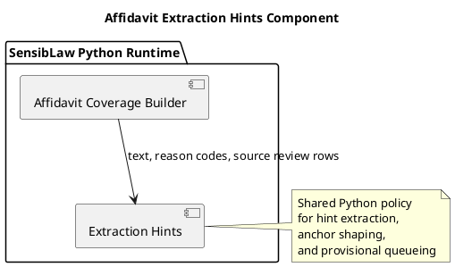

# Affidavit Extraction Hints Component (2026-03-30)

## Purpose
Define the next bounded Python-only normalization slice for the affidavit lane:
extract extraction-hint derivation, candidate-anchor shaping, provisional-anchor
queueing, and hint-driven workload advice from the main builder into a shared
component.

This follows the lexical heuristics extraction and closes the remaining
builder-local anchor/hint policy block.

## ITIL change frame

- Change type: standard change
- Service boundary: affidavit review / contested narrative runtime
- Risk: low, because the slice preserves behavior and moves one coherent policy
  block into a shared owner
- Backout: restore the builder-local anchor and hint helpers if parity breaks

## ISO 9000 quality intent

The quality objective is to give extraction hints and provisional anchors one
explicit owner.

That owner should define:

- hint extraction packet shape
- candidate-anchor derivation
- provisional-anchor ranking and dedupe
- anchor-bundle rollup
- hint-aware workload recommendation behavior

## Six Sigma defect target

Current defect mode:

- hint extraction and anchor shaping still live inline in the builder
- anchor ranking and bundle rollup policy are not reusable across lanes
- future anchor-heavy lanes could drift on queueing and recommendation
  behavior

This slice reduces variation by making one canonical Python component for:

- transcript, calendar, and procedural-event hint extraction
- candidate-anchor packets
- provisional-anchor queue ranking
- source-row bundle rollups
- hint-aware workload recommendations

## C4 component reading

Container:

- SensibLaw Python runtime

Components after this slice:

- affidavit coverage builder:
  row assembly, orchestration, payload emission
- affidavit extraction hints component:
  hint extraction, anchor packets, provisional queues, workload advice

## PlantUML sketch

## Acceptance

This slice is complete when:

- extraction hints and provisional-anchor logic no longer live inline in the
  main builder
- they live in one Python-owned shared module
- the builder still exposes the same helper hooks for current callers and
  tests
- focused affidavit regressions remain green

## Non-goals

This slice does not:

- change arbitration order
- change lexical cue rules
- change response semantics
- change artifact schema
