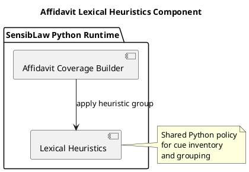

# Affidavit Lexical Heuristics Component (2026-03-30)

## Purpose
Define the next bounded Python-only normalization slice for the affidavit lane:
extract lexical heuristic grouping and justification cue policy from the main
builder into a shared component.

This follows the structural sentence adapter extraction and keeps the remaining
work on explicit policy boundaries.

## ITIL change frame

- Change type: standard change
- Service boundary: affidavit review / contested narrative runtime
- Risk: low, because the slice preserves behavior and mainly moves a rule table
  plus matcher
- Backout: restore the builder-local heuristic policy if parity breaks

## ISO 9000 quality intent

The quality objective is to give lexical cue policy one explicit owner.

That owner should define:

- the heuristic rule inventory
- cue grouping by label
- match packet shape
- rule application behavior

## Six Sigma defect target

Current defect mode:

- heuristic cue policy is embedded inside the builder
- future lanes are likely to copy the rule inventory or matcher behavior

This slice reduces variation by making one canonical Python component for:

- heuristic rule inventory
- heuristic cue grouping
- justification cue matching

## C4 component reading

Container:

- SensibLaw Python runtime

Components after this slice:

- affidavit coverage builder:
  composition and payload assembly
- affidavit lexical heuristics component:
  lexical cue inventory and grouping policy

## PlantUML sketch

## Acceptance

This slice is complete when:

- lexical heuristic grouping no longer lives inline in the main builder
- it lives in one Python-owned shared module
- the builder still exposes the same helper hook for current callers and tests
- focused affidavit regressions remain green

## Non-goals

This slice does not:

- change response semantics
- change parser semantics
- change artifact schema
