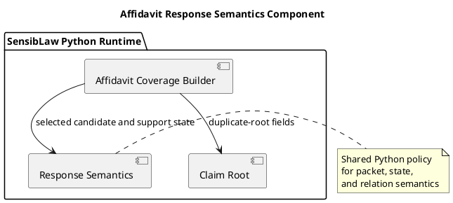

# Affidavit Response Semantics Component (2026-03-30)

## Purpose
Define the next bounded Python-only normalization slice for the affidavit lane:
extract response semantics policy from the main affidavit builder into a
shared component.

This follows the arbitration-core extraction and keeps the Mary-parity work on
real decision boundaries instead of generic helper churn.

## ITIL change frame

- Change type: standard change
- Service boundary: affidavit review / contested narrative runtime
- Risk: moderate, because the slice preserves behavior but touches the
  semantic interpretation of already-selected candidates
- Backout: restore the builder-local semantics block if parity breaks

## ISO 9000 quality intent

The quality objective is to give response semantics one explicit owner.

That owner should define:

- response packet shaping
- primary target-component choice
- semantic-basis choice
- claim-state derivation
- missing-dimension derivation
- relation classification

## Six Sigma defect target

Current defect mode:

- response semantics are still buried in the main builder
- future lanes are likely to duplicate packet and relation policy instead of
  reusing it

This slice reduces variation by making one canonical Python component for:

- response packet policy
- claim-state policy
- relation-explanation policy

## C4 component reading

Container:

- SensibLaw Python runtime

Components after this slice:

- affidavit coverage builder:
  candidate preparation, arbitration call, and payload assembly
- affidavit text normalization component:
  tokenization and decomposition policy
- affidavit claim-root component:
  duplicate-root and claim-root policy
- affidavit candidate-alignment component:
  predicate, quote, and family-adjustment policy
- affidavit candidate-arbitration component:
  winner selection policy
- affidavit response-semantics component:
  packet, state, and relation policy

## PlantUML sketch

## Acceptance

This slice is complete when:

- response-semantics helpers no longer live inline in the main builder
- they live in one Python-owned shared module
- the builder still exposes the same helper names for current callers and
  tests
- focused affidavit regressions remain green

## Non-goals

This slice does not:

- change arbitration order
- move parser glue
- change artifact schema
