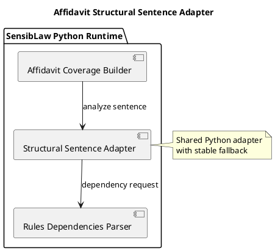

# Affidavit Structural Sentence Adapter (2026-03-30)

## Purpose
Define the next bounded Python-only normalization slice for the affidavit lane:
extract structural sentence analysis and parser fallback behavior from the main
builder into a shared adapter component.

This follows the response-semantics extraction and keeps the remaining work on
clean adapter boundaries.

## ITIL change frame

- Change type: standard change
- Service boundary: affidavit review / contested narrative runtime
- Risk: low, because the slice preserves behavior and keeps the same public
  builder hook for current tests
- Backout: restore the builder-local parser adapter if parity breaks

## ISO 9000 quality intent

The quality objective is to give parser-facing structural analysis one
explicit owner.

That owner should define:

- dependency-parser fallback behavior
- subject and verb extraction surface
- negation signal
- first-person signal
- hedge-verb signal

## Six Sigma defect target

Current defect mode:

- parser-facing glue is buried inside the builder
- future lanes are likely to copy the same adapter logic instead of reusing it

This slice reduces variation by making one canonical Python adapter for:

- structural sentence analysis
- parser failure fallback
- hedge-verb policy

## C4 component reading

Container:

- SensibLaw Python runtime

Components after this slice:

- affidavit coverage builder:
  composition and payload assembly
- affidavit structural sentence adapter:
  parser-facing structural sentence analysis

## PlantUML sketch

## Acceptance

This slice is complete when:

- structural sentence analysis no longer lives inline in the main builder
- it lives in one Python-owned shared adapter module
- the builder still exposes the same hook name for current callers and tests
- focused affidavit regressions remain green

## Non-goals

This slice does not:

- change parser semantics
- move lexical heuristic policy
- change artifact schema
