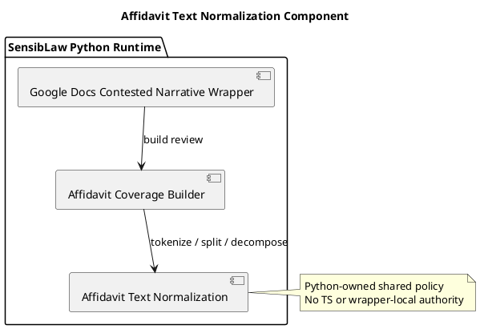

# Affidavit Text Normalization Component (2026-03-30)

## Purpose
Define the next bounded Python-only normalization slice for the affidavit lane:
extract reusable text tokenization and clause-splitting policy from the main
builder into a shared component.

This note follows the existing Python-owned domain rule and treats the change
as a controlled standard change inside the affidavit runtime.

## ITIL change frame

- Change type: standard change
- Service boundary: affidavit review / contested narrative runtime
- Risk: low, because the slice is behavior-preserving and fixture-backed
- Backout: restore builder-local helper definitions if parity breaks

## ISO 9000 quality intent

The process requirement is simple:

- document the boundary first
- define one reusable owner for the helper logic
- keep the public builder contract stable
- verify the same acceptance behavior with focused tests

## Six Sigma defect target

Current defect mode:

- token filtering and clause-splitting policy are hidden inside one large
  builder file
- future affidavit lanes are likely to copy those helpers instead of reusing
  them

This slice reduces variation by making one canonical Python helper surface for:

- token normalization
- predicate-focus token selection
- source text segment splitting
- source clause splitting
- numbered rebuttal detection
- affidavit sentence clause splitting
- affidavit proposition decomposition

## C4 component reading

Container:

- SensibLaw Python runtime

Components after this slice:

- Google Docs contested narrative wrapper:
  orchestration only
- affidavit coverage builder:
  scoring and reconciliation only
- affidavit text normalization component:
  reusable tokenization and splitting policy

## PlantUML sketch

## Acceptance

This slice is complete when:

- the tokenization and clause-splitting helpers no longer live inline in
  `SensibLaw/scripts/build_affidavit_coverage_review.py`
- they live in one Python-owned shared module
- the builder still exposes the same helper names for current callers/tests
- focused affidavit tests remain green

## Non-goals

This slice does not:

- move scoring heuristics
- move relation classification
- solve duplicate-root clustering fully
- change the user-facing artifact contract
