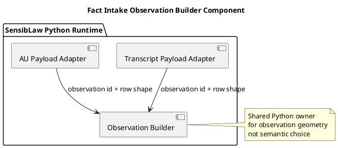

# Fact Intake Observation Builder Component (2026-03-31)

## Purpose
Define the next transcript/AU normalization slice after shared payload and
bundle scaffolding: move duplicated observation row geometry behind one shared
Python component.

Transcript and AU should keep owning lane-specific role and relation mapping,
but they should not keep rebuilding observation IDs and common row fields for
every emitted observation.

## ITIL change frame

- Change type: standard change
- Service boundary: SensibLaw fact-intake observation adaptation runtime
- Risk: low, because only row construction moves while predicate choice and
  lane-specific semantics stay local
- Backout: restore builder-local observation row dictionaries if parity breaks

## ISO 9000 quality intent

The quality objective is to give transcript and AU one Python owner for stable
observation identity and shape.

This slice should preserve:

- observation ID determinism
- observation field names and meanings
- existing predicate families
- existing provenance keys

## Six Sigma defect target

Current defect mode:

- transcript and AU both rebuild the same observation row structure inline
- transcript and AU both hash observation IDs inline
- row-shape changes could drift across lanes even when semantics stay the same

This slice reduces variation by reusing one canonical Python component for:

- observation ID generation
- shared observation row construction

## C4 component reading

Container:

- SensibLaw Python runtime

Components after this slice:

- Transcript payload adapter:
  transcript-specific observation semantics
- AU payload adapter:
  AU-specific anchor, role, and legal relation semantics
- Fact-intake observation builder:
  shared observation identity and row geometry

## PlantUML sketch

## Acceptance

This slice is complete when:

- transcript and AU no longer build observation row dictionaries inline for
  the shared fields
- both consume one shared observation builder
- focused transcript and AU regressions remain green

## Non-goals

This slice does not:

- merge transcript and AU relation semantics
- rewrite predicate-family policy
- change read-model persistence
