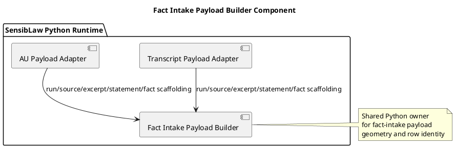

# Fact Intake Payload Builder Component (2026-03-31)

## Purpose
Define the next normalization slice directly below the fact-review bundle
component: move duplicated transcript and AU fact-intake payload scaffolding
behind one shared Python component.

The transcript and AU adapters should keep owning lane-specific role and
relation observation mapping, but they should not keep rebuilding run identity,
source rows, excerpt shells, statement shells, fact-candidate shells, or the
final payload envelope separately.

## ITIL change frame

- Change type: standard change
- Service boundary: SensibLaw fact-intake payload adaptation runtime
- Risk: low, because fact-intake schema stays stable and only duplicated row
  scaffolding moves
- Backout: restore builder-local payload scaffolding if parity breaks

## ISO 9000 quality intent

The quality objective is to give transcript and AU payload adaptation one
shared Python owner for stable fact-intake row geometry.

This slice should preserve:

- fact-intake payload schema
- run ID determinism
- source ID determinism
- excerpt, statement, and fact-candidate identifiers
- lexical projection provenance

## Six Sigma defect target

Current defect mode:

- transcript and AU each rebuild run-basis hashing
- transcript and AU each rebuild source row creation and late source fallback
- transcript and AU each rebuild excerpt, statement, and fact-candidate shells
- changes to payload scaffolding would otherwise drift across lanes

This slice reduces variation by reusing one canonical Python component for:

- run-basis hashing
- source row creation and late source fallback
- excerpt shell creation
- statement shell creation
- fact-candidate shell creation
- payload envelope emission

## C4 component reading

Container:

- SensibLaw Python runtime

Components after this slice:

- Transcript payload adapter:
  transcript-specific role and relation observation mapping
- AU payload adapter:
  AU-specific anchor, role, and legal relation observation mapping
- Fact-intake payload builder:
  shared payload scaffolding and deterministic row identity policy

## PlantUML sketch

## Acceptance

This slice is complete when:

- transcript and AU no longer own duplicate payload scaffolding logic
- both consume the shared Python payload-builder component
- existing payload IDs and schema stay stable
- focused transcript/AU regressions remain green

## Non-goals

This slice does not:

- merge transcript and AU observation semantics
- change fact-intake schema
- rewrite read-model persistence
