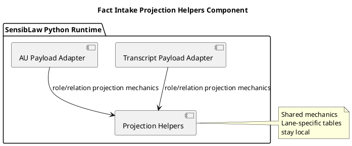

# Fact Intake Projection Helpers Component (2026-03-31)

## Purpose
Define the next transcript/AU normalization slice after shared observation row
geometry: move reusable role and relation projection mechanics behind one
shared Python component.

Transcript and AU should still own their lane-specific role maps and relation
policies, but they should not keep duplicating relation-status policy,
fact-status policy, and generic role/relation observation emission mechanics.

## ITIL change frame

- Change type: standard change
- Service boundary: SensibLaw fact-intake semantic projection runtime
- Risk: medium-low, because row shape is already centralized and this slice
  only moves shared projection helpers, not lane-specific mapping tables
- Backout: restore builder-local projection helpers if parity breaks

## ISO 9000 quality intent

The quality objective is to give transcript and AU one Python owner for shared
projection mechanics while preserving lane-specific semantics.

This slice should preserve:

- observation status behavior for promoted, abstained, and candidate relations
- fact status behavior for captured, uncertain, and abstained observations
- current role and relation observation identity inputs

## Six Sigma defect target

Current defect mode:

- transcript and AU each define the same relation-status policy
- transcript and AU each define the same fact-status policy
- transcript and AU each duplicate generic role/relation observation emission
  mechanics even when the mapping tables differ

This slice reduces variation by reusing one canonical Python component for:

- relation-status projection
- statement fact-status projection
- generic role observation emission
- generic relation observation emission

## C4 component reading

Container:

- SensibLaw Python runtime

Components after this slice:

- Transcript payload adapter:
  transcript role map and relation mapping table
- AU payload adapter:
  AU role map and legal-procedural relation selection
- Fact-intake projection helpers:
  shared role/relation projection mechanics

## PlantUML sketch

## Acceptance

This slice is complete when:

- transcript and AU no longer own duplicate relation-status helpers
- transcript and AU no longer own duplicate fact-status helpers
- transcript and AU consume shared role/relation observation emitters
- focused transcript and AU regressions remain green

## Non-goals

This slice does not:

- merge transcript and AU mapping tables
- change lane-specific predicate choices
- change fact-intake schema
