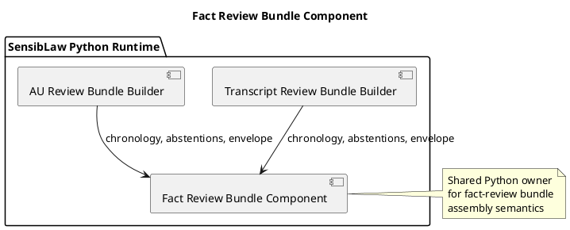

# Fact Review Bundle Component (2026-03-31)

## Purpose
Define the next review-family normalization slice after affidavit, GWB, and
Wikidata queue normalization: move duplicated transcript and AU fact-review
bundle assembly behind one shared Python component.

The transcript and AU bundle builders should keep owning lane-specific semantic
context and any extra operator views, but they should not keep owning duplicate
chronology assembly, abstention rollup, or bundle-envelope shaping.

## ITIL change frame

- Change type: standard change
- Service boundary: SensibLaw fact-intake review bundle runtime
- Risk: low, because the emitted bundle schema stays stable and only duplicate
  assembly logic moves
- Backout: restore builder-local chronology, abstention, and envelope helpers
  if parity breaks

## ISO 9000 quality intent

The quality objective is to give transcript and AU review bundles one Python
owner for shared bundle geometry.

This slice should preserve:

- existing fact review bundle schema
- current chronology ordering
- current abstention counts
- current review queue, chronology groups, and operator view surfaces

## Six Sigma defect target

Current defect mode:

- transcript and AU each rebuild chronology rows
- transcript and AU each rebuild abstention summaries
- transcript and AU each shape the same review-bundle envelope independently

This slice reduces variation by reusing one canonical Python component for:

- chronology assembly
- abstention rollup
- fact review bundle envelope shaping

## C4 component reading

Container:

- SensibLaw Python runtime

Components after this slice:

- Transcript review bundle builder:
  transcript-specific semantic context and payload adaptation
- AU review bundle builder:
  AU-specific semantic context, legal-procedural summary, and authority follow
  view
- Fact review bundle component:
  shared chronology, abstentions, and bundle envelope policy

## PlantUML sketch

## Acceptance

This slice is complete when:

- transcript and AU no longer own duplicate chronology assembly
- transcript and AU no longer own duplicate abstention rollup
- transcript and AU both consume the shared Python component for bundle
  shaping
- the existing fact review bundle schema remains valid
- focused transcript and AU regressions remain green

## Non-goals

This slice does not:

- merge transcript and AU semantic payload adaptation
- change lane-specific operator views
- change the fact review bundle schema
- widen this into a generic semantic report adapter
