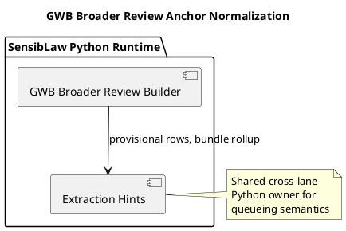

# GWB Broader Review Anchor Normalization (2026-03-31)

## Purpose
Define the next cross-lane reuse slice after GWB public review and Wikidata:
move GWB broader review off its builder-local provisional-review queueing logic
and onto the shared Python extraction-hints component.

The broader GWB builder should keep owning its lane-specific anchor kinds, but
it should not keep owning generic provisional queue ranking or bundle rollup.

## ITIL change frame

- Change type: standard change
- Service boundary: GWB broader review runtime
- Risk: low, because the artifact shape stays stable and only duplicated
  queueing math moves
- Backout: restore the builder-local provisional-row and bundle helpers if
  parity breaks

## ISO 9000 quality intent

The quality objective is to give GWB broader review the same queue owner as the
checked GWB and affidavit lanes.

This slice should preserve:

- existing broader-review artifact fields
- current provisional-review ordering
- current bundle counts and top-score ordering

## Six Sigma defect target

Current defect mode:

- broader GWB review still owns duplicate provisional-row ranking
- broader GWB review still owns duplicate bundle rollup
- fixes to queueing behavior would otherwise need to be copied across GWB
  checked and broader builders

This slice reduces variation by reusing one canonical Python component for:

- provisional review ranking
- bundle rollup

## C4 component reading

Container:

- SensibLaw Python runtime

Components after this slice:

- GWB broader review builder:
  broader-review row assembly and artifact emission
- affidavit extraction hints component:
  shared provisional queueing and bundling policy

## PlantUML sketch

## Acceptance

This slice is complete when:

- broader GWB no longer owns duplicate provisional-review queueing logic
- it consumes the shared Python component
- the emitted broader-review artifact shape remains stable
- focused GWB broader regressions remain green

## Non-goals

This slice does not:

- change broader-review anchor kinds
- change broader-review artifact schema
- widen the shared component into a GWB-specific anchor builder
