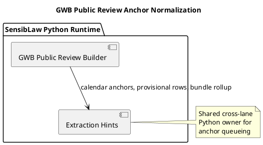

# GWB Public Review Anchor Normalization (2026-03-30)

## Purpose
Record the first cross-lane adoption of the shared Python extraction-hints and
provisional-anchor component after the affidavit lane normalization pass.

The target is the GWB checked public review builder, which currently duplicates
calendar-anchor packets plus provisional-anchor ranking and bundle rollup
behavior.

## ITIL change frame

- Change type: standard change
- Service boundary: GWB checked public review runtime
- Risk: low, because the artifact schema stays stable and the change replaces
  duplicate queueing logic with the existing shared component
- Backout: restore the builder-local ranking and bundle helpers if parity
  breaks

## ISO 9000 quality intent

The quality objective is to reduce cross-lane drift by making GWB consume the
same Python-owned anchor queueing policy already used by the affidavit lane.

This adoption should preserve:

- GWB artifact field names
- current priority ordering
- bundle counts and top-score ordering

## Six Sigma defect target

Current defect mode:

- GWB public review carries its own duplicate anchor ranking and bundle logic
- future fixes to queue ordering would need to be applied twice

This slice reduces variation by reusing one canonical Python component for:

- candidate calendar-anchor shaping
- provisional-anchor ranking
- anchor-bundle rollup

## C4 component reading

Container:

- SensibLaw Python runtime

Components after this slice:

- GWB public review builder:
  GWB-specific row assembly and artifact emission
- affidavit extraction hints component:
  shared anchor packet and queueing policy

## PlantUML sketch

## Acceptance

This slice is complete when:

- GWB no longer owns duplicate provisional-anchor ranking and bundle math
- it consumes the shared Python component
- the emitted GWB artifact shape remains stable
- focused GWB regressions remain green

## Non-goals

This slice does not:

- migrate all GWB workload semantics
- change the GWB artifact contract
- widen the affidavit component into a GWB-specific policy layer
