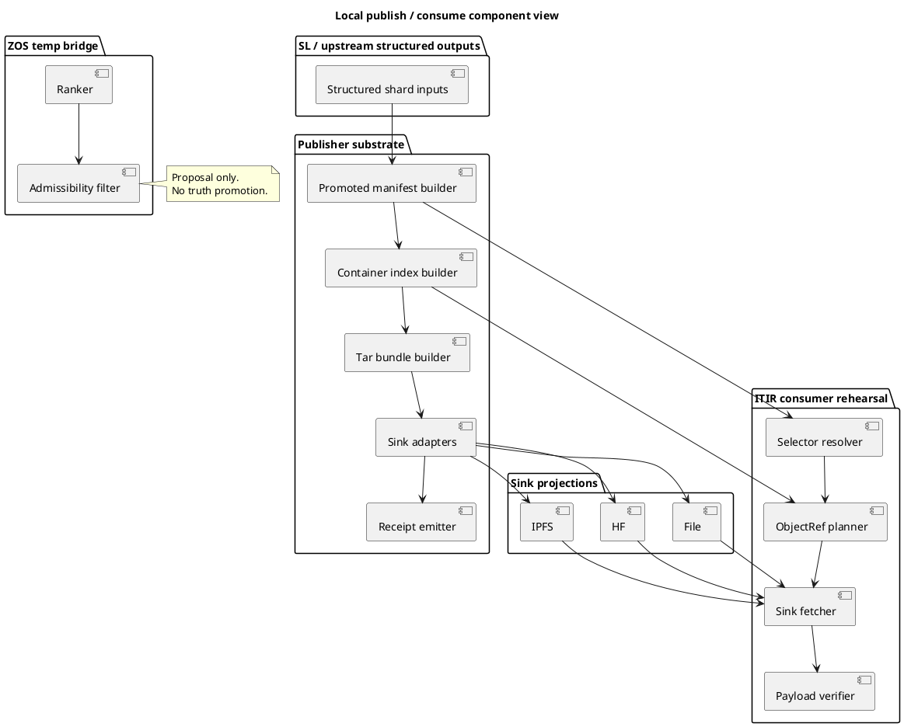
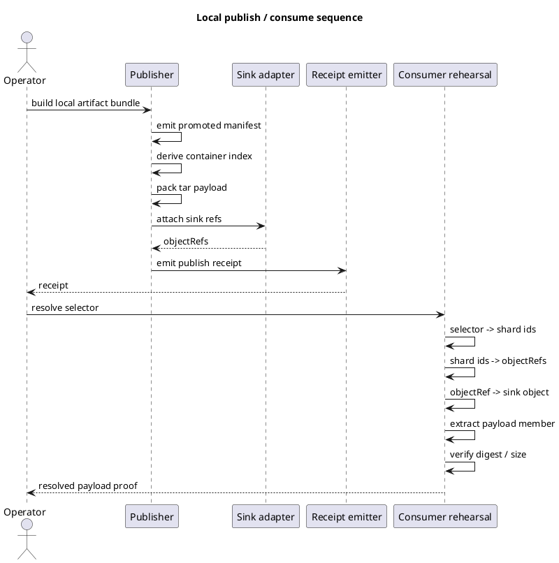

# Local Publish / Consume Release Gates (2026-03-30)

## Purpose

Record the implemented local-first artifact publication and consumption flow,
the release gates used for this pass, and the remaining blockers before any
claim of remote JMD push/pull completion.

This note is implementation-facing. It does not widen semantic authority.

## Scope outcome

Completed in this pass:

- local artifact contract is now exercised against a real emitted bundle
- local publish workflow now emits:
  - promoted manifest
  - container index
  - tar payload
  - sink refs / `objectRefs`
  - per-sink publish receipts
- sink adapters now exist for:
  - `file`
  - `hf` projection
  - `ipfs` projection
- consumer-side rehearsal now proves:
  - selector -> shard ids
  - shard ids -> `objectRefs`
  - `objectRefs` -> fetch
  - fetch -> payload digest / size verification
- `ZOS` boundary cleanup now keeps resonance in proposal/tiebreak only

Not completed in this pass:

- remote HF/IPFS write acknowledgement as an always-on CI-safe test
- remote JMD push/pull semantics

## Implemented surfaces

Publisher substrate in sibling repo:

- `/home/c/Documents/code/erdfa-publish-rs/src/publish.rs`
- `/home/c/Documents/code/erdfa-publish-rs/examples/publish_local.rs`

Consumer/rehearsal surface in this repo:

- `itir_jmd_bridge/hf_rehearsal.py`
- `itir_jmd_bridge/cli.py`
- `tests/test_hf_container_rehearsal.py`

Temporary ZOS governance surface:

- `TEMP_zos_sl_bridge_impl/python/zos_pipeline/retrieval.py`
- `TEMP_zos_sl_bridge_impl/manifold_retrieval.py`

## C4 component view

## Sequence view

## ITIL / ISO 9001 / Six Sigma release reading

Change enablement:

- bounded scope per lane
- additive only
- no semantic authority changes hidden inside transport work

Service validation:

- each lane carries an executable validation surface
- publisher and consumer are validated independently
- the temporary ZOS bridge is validated as proposal-only infrastructure

Traceability:

- manifest identity
- container membership
- sink refs
- content digests
- publish receipts

Defect containment:

- sink adapters do not redefine shard semantics
- consumer fetch is verified against digests, not path names
- resonance does not alter correctness score

Quality gate summary:

- Gate 1: stable shard ids across emitted surfaces -> pass
- Gate 2: digest parity across shard, container, and fetched payload -> pass
- Gate 3: sink refs emitted without semantic mutation -> pass
- Gate 4: local/file end-to-end publish + consume -> pass
- Gate 5: HF/IPFS real network write/read integration in stable CI -> blocked
- Gate 6: remote JMD endpoint/replay/receipt contract -> blocked

## Remaining blockers

### HF/IPFS real network integration

Still blocked as a reliable completion gate because this repo does not have a
deterministic unauthenticated write surface for HF/IPFS that can be treated as
stable CI truth.

### Remote JMD push/pull

Still blocked on:

- endpoint semantics
- replay/cache policy
- receipt / acknowledgement contract

## Current completion reading

Complete for local-first artifact publication and consumption.

Not complete for remote publish/pull or live JMD infrastructure claims.
