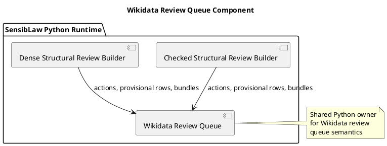

# Wikidata Review Queue Component (2026-03-30)

## Purpose
Define the next cross-lane normalization slice after the first GWB adoption:
extract the Wikidata structural-review queueing and recommendation helpers into
a shared Python component used by both checked and dense structural review.

This keeps AU explicit too: the AU affidavit builders are already thin wrappers
over the normalized affidavit builder and therefore do not need a new semantic
migration slice here.

## ITIL change frame

- Change type: standard change
- Service boundary: Wikidata checked/dense structural review runtime
- Risk: low, because the builders should preserve artifact shape while moving
  duplicated queueing policy into one shared owner
- Backout: restore the builder-local queue helpers if parity breaks

## ISO 9000 quality intent

The quality objective is to give Wikidata review-queue policy one explicit
owner for both checked and dense review artifacts.

That owner should define:

- workload-to-action mapping
- cue-kind priority mapping
- provisional-review row shaping
- bundle ranking

## Six Sigma defect target

Current defect mode:

- checked structural review still owns queueing and recommendation helpers
- dense structural review imports those helpers through the checked builder
  rather than a neutral component
- future queue/ranking changes could drift between builder and adopter layers

This slice reduces variation by making one canonical Python component for:

- workload recommendation policy
- cue priority policy
- provisional-review row ranking
- provisional-review bundle ranking

## C4 component reading

Container:

- SensibLaw Python runtime

Components after this slice:

- Wikidata structural review builders:
  review-item assembly, source-row assembly, payload emission
- Wikidata review queue component:
  queue recommendation and ranking policy

## PlantUML sketch

## Acceptance

This slice is complete when:

- checked and dense structural review no longer keep queueing policy inline in
  a builder file
- both consume one shared Python component
- both artifact shapes remain stable
- focused Wikidata regressions remain green

## Non-goals

This slice does not:

- change review-item counts
- change artifact schema
- widen AU wrappers beyond their current thin composition role
