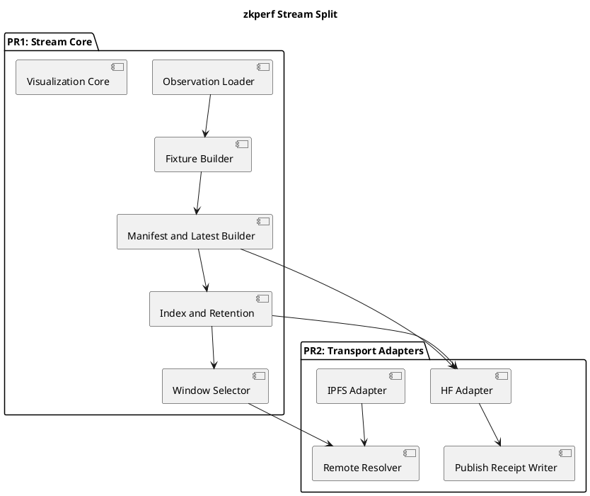

# zkperf Generic Upstreaming To Meta-Introspector

Date: 2026-03-31

## Goal

Prepare a clean upstream lane from `ITIR-suite` into
`meta-introspector/zkperf` for the generic `zkperf` stream and visualization
surfaces, while keeping `SL`/ITIR-specific wrappers local.

## Why Now

`meta-introspector/zkperf` now has newer register-focused work, including:

- register value change tracking
- register pattern analysis across IP regions
- divergence-map / slow-path analysis
- tagged FRACTRAN-style flow-event filtering

The local renderer and stream surface should therefore be treated as a generic
`zkperf` extension layer over register-bearing observations, not as an
`SL`-specific artifact.

## Current Inputs

This note is grounded in:

- `docs/planning/zkperf_stream_shard_contract_v1_20260330.md`
- `docs/planning/zkperf_spectrogram_rendering_contract_20260330.md`
- adjacent-repo boundary examples from:
  - `../zkperf`
  - `../zos-server`
  - `../ipfs-dasl`
  - `../solfunmeme-dioxus`

## Scope Split

### Upstream candidate surface

- `itir_jmd_bridge/zkperf_viz.py`
- `itir_jmd_bridge/zkperf_stream_core.py`
- `itir_jmd_bridge/zkperf_stream_index.py`
- `itir_jmd_bridge/zkperf_stream_transport.py`
- generic CLI/test/doc support for stream fixtures, publish/resolve, and
  register-aware visualization

### Keep local to ITIR-suite

- `itir_jmd_bridge/sl_zkperf.py`
- `scripts/render_sl_zkperf_spectrogram.py`
- `scripts/run_sl_with_zkperf.py`
- `scripts/build_zkperf_observation_from_sl.py`
- `scripts/run_sl_zkperf_stream_hf.sh`
- SL-specific tests and planning notes

## Current Constraint

The local work is still bundled inside a broad ITIR commit and changelog lane.
Before upstreaming, the file surface must be recut around generic `zkperf`
contracts instead of the current `SL -> zkperf -> stream -> HF` framing.
That recut is now physically done; the remaining work is to keep
`itir_jmd_bridge/zkperf_stream.py` as a compatibility facade only, not the
canonical import surface for PR preparation.

## Architecture Decision

The current split should follow a package-boundary rule rather than a
single-file convenience rule.

The comparison repos support that:

- `meta-introspector/zkperf`
  - keeps recording and witness responsibilities legible at the workspace and
    tool boundary
- `zos-server`
  - keeps transport substrate such as `zos-libp2p` separate from governing
    sync-convergence policy and system context
- `ipfs-dasl`
  - keeps the differential harness narrow and transport-free
- `solfunmeme-dioxus`
  - treats external MCP access as an adapter layer rather than product
    semantics

The corresponding `zkperf` split here is:

- PR1:
  - stream contract core
  - stream/index/latest/selection logic
  - register-aware visualization
  - generic tests and docs
- PR2:
  - HF/IPFS publish and resolve adapters
  - remote verification receipts and timing surfaces
- keep local:
  - `SL` wrappers and operator scripts

This is the current controlled architecture decision for the lane.

## ITIL Change Frame

- change type:
  - standard change
- service boundary:
  - `zkperf` stream and visualization semantics are the governed product
    surface
  - HF and IPFS are provider adapters behind that surface
- release discipline:
  - promote the core contract lane before transport-adapter widening

## ISO 9000 Quality Intent

- one explicit owner for stream/window/index semantics
- one explicit owner for visualization semantics
- separate adapter behavior from product semantics so acceptance criteria stay
  stable when transport implementations change

## Six Sigma Defect Target

Reduce variance by removing one current defect source:

- contract logic and transport logic are coupled inside one module

Target state:

- core stream behavior can change and be tested without provider mocks
- provider behavior can change without revalidating the core contract surface

## C4-Oriented Boundary

### System context

- producers emit `ZKPerfObservation` objects into the stream core
- the stream core owns stream/window/index semantics
- HF and IPFS are external transport systems
- `SL` remains an ITIR-local producer/adapter lane

### Container view

- stream core
- visualization core
- HF transport adapter
- IPFS transport adapter
- ITIR-local `SL` wrappers

### Component view for PR1

- observation loading / normalization
- fixture building from observations
- stream bundle metadata construction
- latest artifact construction
- revision index construction
- retention policy
- revision record lookup
- window selection

### Component view for PR2

- HF publish / fetch / verify
- HF index publish / resolve
- IPFS fetch / resolve
- remote window materialization
- publish receipt persistence

## PlantUML Sketch

## Artifact Split Matrix

### PR1

- generic stream contract core
- observation loading / normalization
- fixture and bundle construction
- latest/index/retention logic
- window selection
- register-aware visualization
- generic tests and docs

### PR2

- HF publish / fetch / verify
- HF index publication / resolution
- IPFS fetch / resolution
- remote window materialization
- publish and verification receipts

### Keep Local To ITIR-suite

- `itir_jmd_bridge/sl_zkperf.py`
- `scripts/render_sl_zkperf_spectrogram.py`
- `scripts/run_sl_with_zkperf.py`
- `scripts/build_zkperf_observation_from_sl.py`
- `scripts/run_sl_zkperf_stream_hf.sh`
- `SL`-specific tests and planning notes

### Split Before Upstreaming

- `itir_jmd_bridge/zkperf_stream.py`
- any tests that currently mix core-contract and transport assertions

## Worker Lanes

### Lane A: upstream file-surface cut

- identify:
  - generic include set
  - `SL`/ITIR exclude set
  - files that need a split before upstreaming

### Lane B: vis/register alignment

- update the generic visualization surface so it can consume the newer
  register/flow/tagged observation shapes without depending on `SL`

### Lane C: stream core versus transport split

  - identify:
    - pure stream-core functions for PR1
    - transport/provider functions for PR2
    - export/test fallout from the split

## Non-goals

- upstreaming `SL` wrappers
- claiming transport-neutral remote integration when provider coupling is still
  inside the core lane
- treating HF/IPFS adapters as the defining `zkperf` product surface

## Promotion Gate

Promote upstream only when:

- docs and TODOs explicitly describe the genericized lane
- the architecture note explicitly separates contract core from transport
  adapters
- the artifact split matrix explicitly names PR1, PR2, keep-local, and
  split-first surfaces
- the file set is separated from `SL` wrappers
- tests prove the renderer works over generic register-bearing observations
- provider coupling is explicitly isolated into PR2 unless a smaller generic
  transport-neutral seam is proven

## Immediate Next Step

Use the worker-lane outputs to freeze:

1. the PR1 file set
2. the vis changes required for register-aware input
3. the physical stream-core module boundary for PR1
4. the transport-adapter module boundary for PR2
